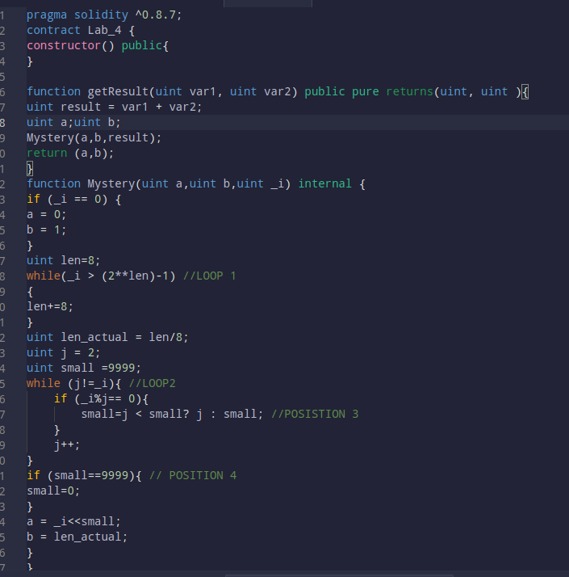

# Lab 5 
## Details : 
- Name : P K Navin Shrinivas 
- SRN : PES2UG20CS237
- Section : D 
## Task 1:
- Outputs : 


- The outputs follows a logic like so : 
	- If the sum of 2 number is a prime number it sum as the first number. 
	- Else if multiplies the sum of 2 number with 2, n number of times. Where n is the smallest number sum of 2 numbers (input) is divisible by.
	- The scond number is number of `bytes` requriered to represent the sum of 2 numbers. 
- Explaining the loops : 
	- Loop 1 : Find the number of bit requried to represent the sum of 2 numbers. It does so by increment the len by 8 if the binary rep range of len is greater than the sum of 2 numbers (_i).
	- Loop 2 : Find the smallest number sum of 2 numbers is divisible by. If not, we set small to 0. 
- Replaing `POSISTION3` code : 

- Small being assigned to 0 in POSISTION 4 implies that the sum of 2 numbers is a prime number and hence we do not shift the number by anything.
- Returning the 2 numbers without any return statement : 

## Task 2 :
- Code of the contract : 
```java
pragma solidity ^0.8.7;
contract Contract_XYZ{
	function Set_Method(uint var1, uint var2) public pure returns(uint[] memory){
		uint[] memory res = new uint[](var1);
		for(uint i=0;i<var1;i++){
			res[i] = i*var2;
		}
		return res;
	}
}
```
- Output screenshot : 

## Task 3:
- Deployment of CODE 1 : 


- Deployment of CODE 1 : 

