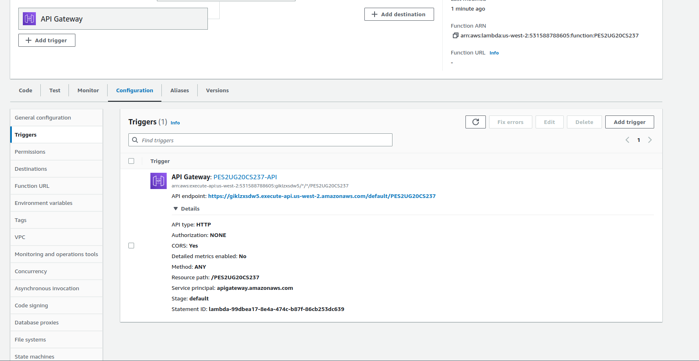
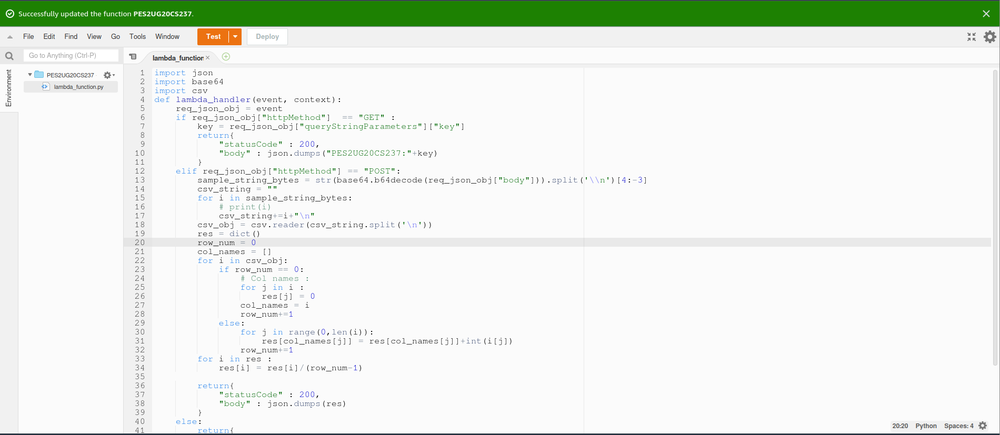
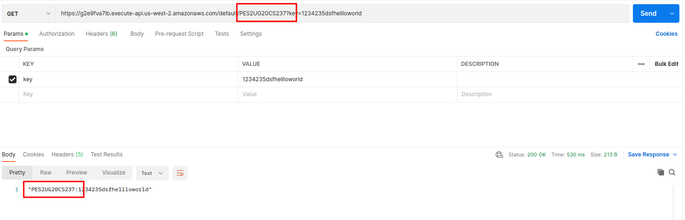
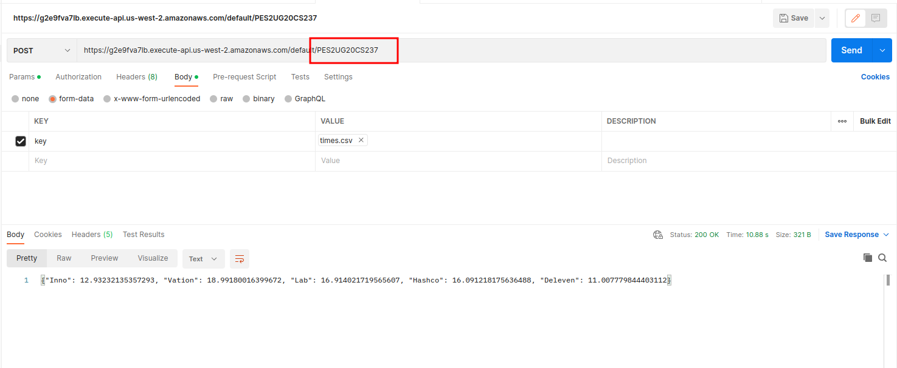
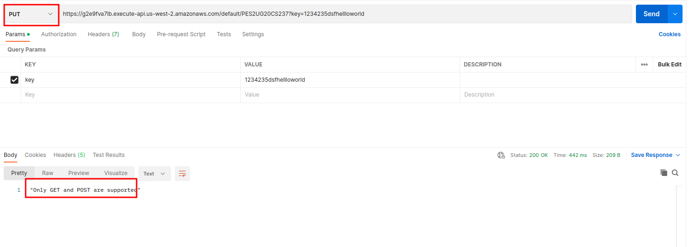

## Details : 
- Name : P K Navin Shrinivas
- SRN : PES2UG20CS237
- Section : D 
## Creating lambda function 

> Note : Note the name of lambda function, it is the SRN.

## API gateway, the trigger 
> Note : the gateways is a normal HTTP gateway with cors enabled.


## The function
> Note : this image doesn't cover the full code, hence I have pasted the code as well. 


```python
import json
import base64
import csv 
def lambda_handler(event, context):
    req_json_obj = event
    if req_json_obj["httpMethod"]  == "GET" :
        key = req_json_obj["queryStringParameters"]["key"]
        return{
            "statusCode" : 200,
            "body" : json.dumps("PES2UG20CS237:"+key)
        }
    elif req_json_obj["httpMethod"] == "POST":
        sample_string_bytes = str(base64.b64decode(req_json_obj["body"])).split('\\n')[4:-3]
        csv_string = ""
        for i in sample_string_bytes:
            # print(i)
            csv_string+=i+"\n"
        csv_obj = csv.reader(csv_string.split('\n'))
        res = dict()
        row_num = 0
        col_names = []
        for i in csv_obj:
            if row_num == 0:
                # Col names : 
                for j in i :
                    res[j] = 0
                col_names = i
                row_num+=1
            else:
                for j in range(0,len(i)): 
                    res[col_names[j]] = res[col_names[j]]+int(i[j])
                row_num+=1
        for i in res : 
            res[i] = res[i]/(row_num-1)

        return{
            "statusCode" : 200,
            "body" : json.dumps(res)
        }
    else:
        return{
            "statusCode" : 200,
            "body" : json.dumps("Only GET and POST are supported")
        }
    
    
    # return {
    #     'statusCode': 200,
    #     'body': json.dumps(event,indent=4)
    # }
```
## GET request in postman 

## POST request in postman 
> Note : the files is being loaded as a form-data in the postman body 


## Methods other than POST and GET
