# Cloud Computing Assignment 2

## Details : 
- SRN : PES2UG20CS237
- Name : P K Navin Shrinivas
- Section : D 
## Task 1 : Using docker to setup Jenkins locally
- Create the following file in the directory : 
**Dockerfile :**
```
FROM jenkins/jenkins:lts
USER root
RUN apt-get update && apt-get install -y make && apt-get install -y g++
USER jenkins
```
- Let's build the image : 
```
sudo docker build . -t localjenkins:PES2UG20CS237
```
- Run the above image eposing port 8080 to 8080 and port 50000 to 50000 and in interactive mode : 
```
sudo docker run -p 8080:8080 -p 50000:50000 -it localjenkins:PES2UG20CS237 #1.png
```
- Note the password, open put localhost:8080 and make sure to install the github plugin when setting up.
- 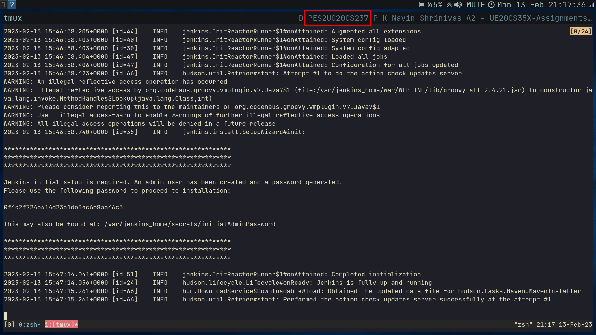
## Task 2 : Setup a jenkins job and connect it to a github repo for auto build.

- Create a new repo and add the following files : 
**hello.cpp :**
```cpp
//File: hello.cpp
#include <iostream>
using namespace std;
__asm__(".symver realpath,realpath@GLIBC_2.2.5");
// Above line is important as ldd and g++ disagree over glibc version
int main(void) {
  cout << "Hello, World\n";
  cout << "Hello, Jenkins\n";
  cout << "I have successfully built and run\n";
  return 0;
}
```
**Makefile :**
```
hello_exec: hello.cpp
	g++ hello.cpp -o hello_exec
```
- Push the repo to github 
- Now open up the jenkins dashboard and create a New Item named `SRN-1` in freestyle mode.
- Add the following : 
	- Github link
	- select `Git` as `SCM` and enter repo link, go to advanced and add a new brach `*/main`
	- Build trigger is `Poll SCM` and the schedule `H/5 * * * *`
	- Add build step of `Execute Shell` and the command being : 
	```
	rm -r hello_exec
	make
	
	```
	- Save and trigger a new build.
- 2.png and 3.png are ss of success build list and console output.
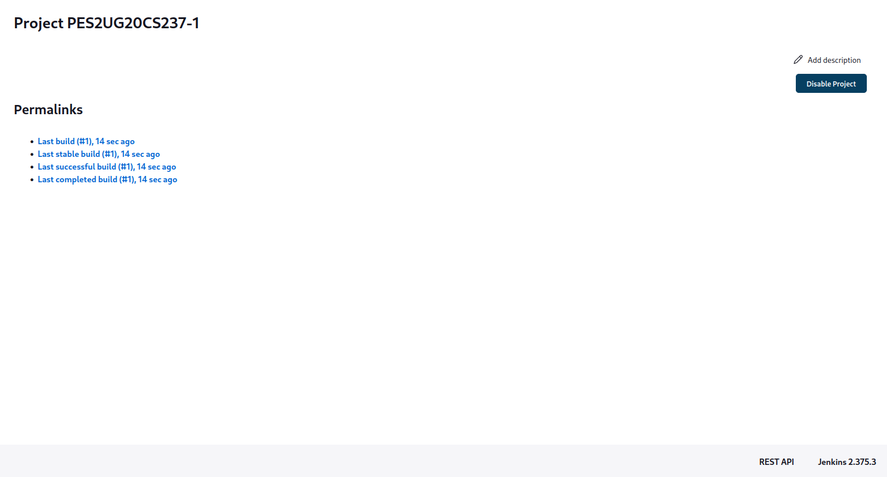
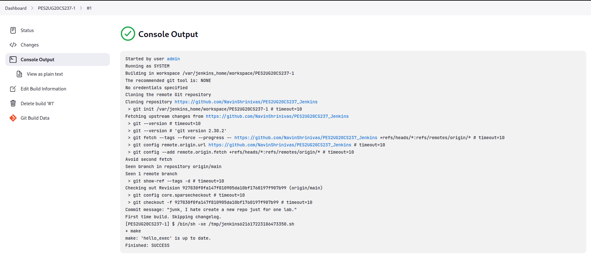
## Task 3 : Adding post build triggers
- Create a second New Item in free style and only add a build step in Execute shell with the follwing command :
```
/var/jenkins_home/workspace/<the  
name of your first project>/hello_exec
```
- Save and go to the first Item and do the follwing : 
	- Go to the bottom and a `Post build Action`, Select `build other projects` and enter name of second job.
	- Save this new config and trigger a new build.
- Screenshots : 
	- Console output of second job 4.png
	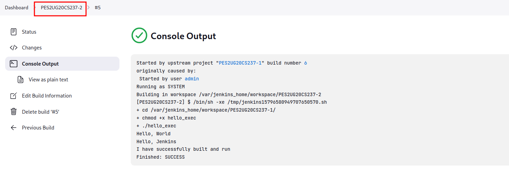
	- status page of first 5.png 
	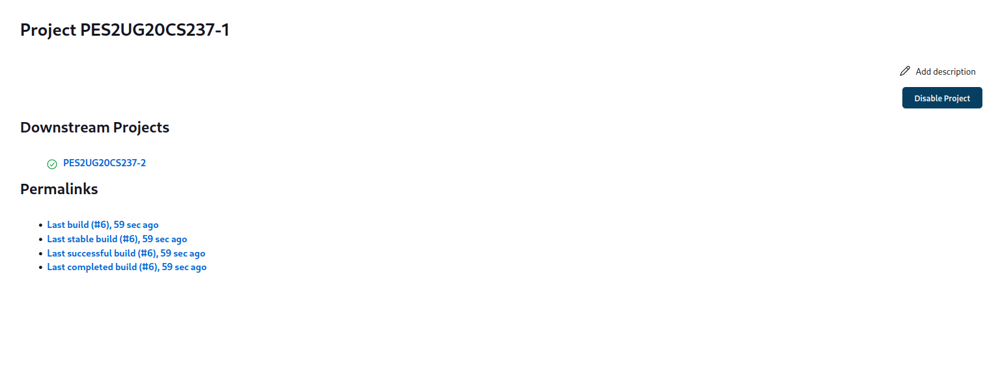
	- build history of jenkins 6.png
	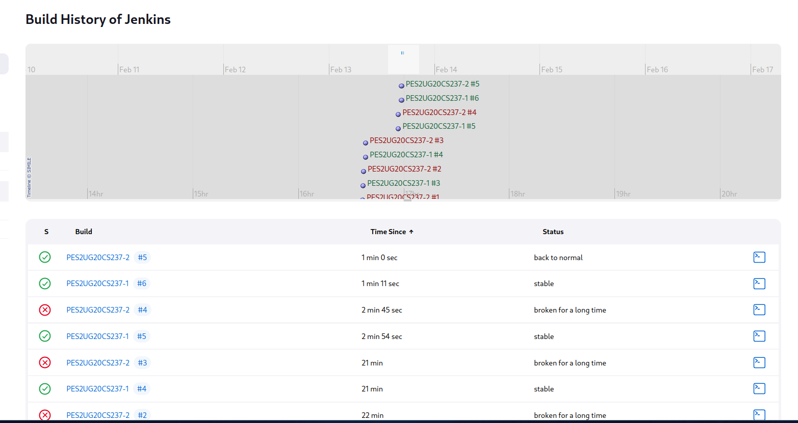
	- jenkins dashboard 7.png
	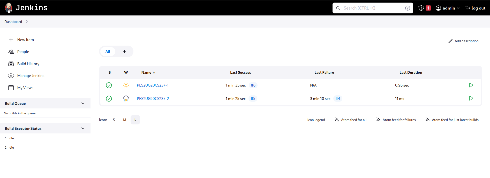

## Task 4 : Adding webhook trigger in github
- Install ngrok 
- Expose port 8080 : 
```
ngrok http 8080
```
- Note the exposing url. This the link to be added in webhook on github. append the neeeded parts to the webhook such as : `github-webhook`
- Go to setting of the first item and enable `Github hook trigger`
- Now do any change to the repo and a git push should trigger a build automatically!
- Screenshots for this task : 
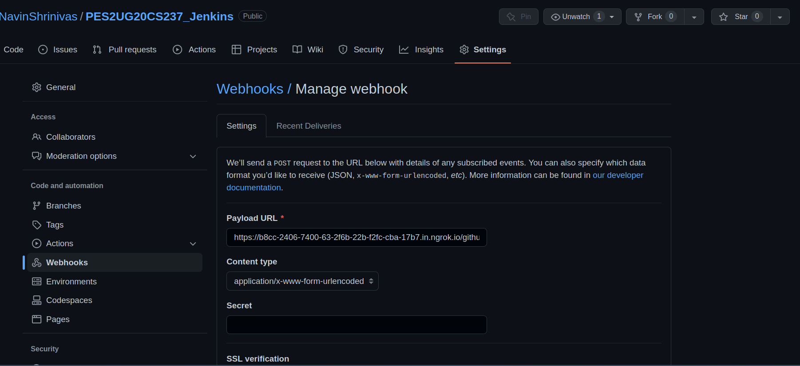
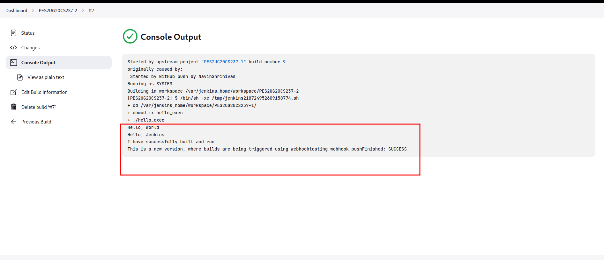
## Task 5 : Creating a jenkins pipeline
- Create a new Item and select pipeline, select the following : 
	- github link
	- github webhook trigger 
	- Pipeline from SCM and the usual stuff (remember */main)
- The following are the screenshots : 
	- SS of script 10.png 
	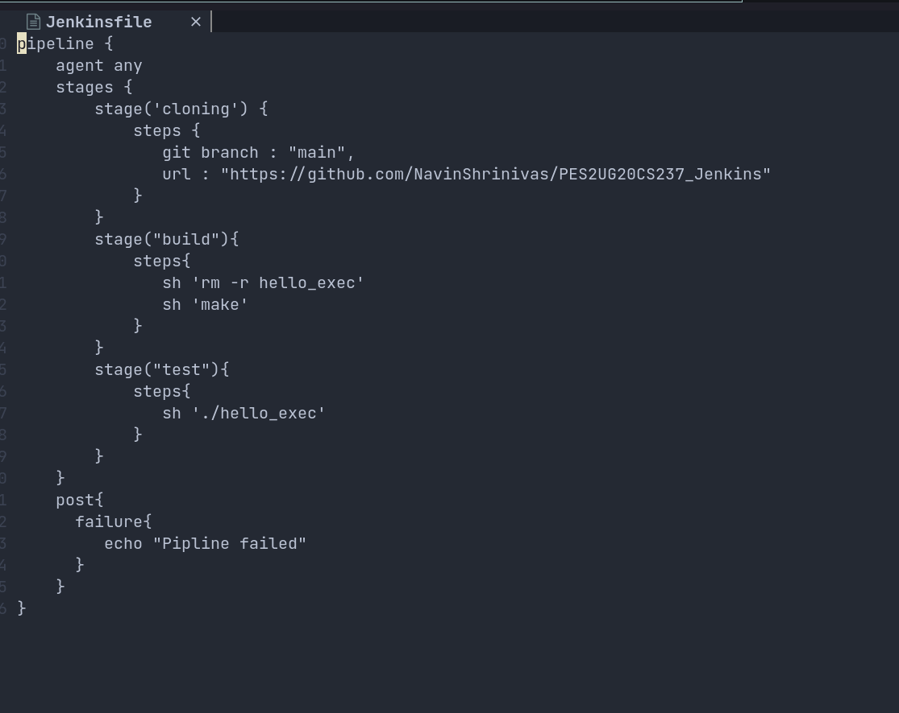
	- SS of the pipeline steps 11.png
	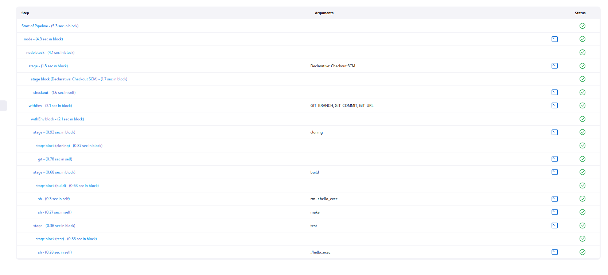
	- SS of pipline console output 12.png
	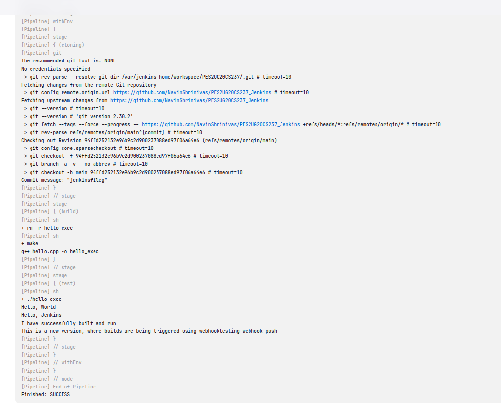
- Link to the repo : "https://github.com/NavinShrinivas/PES2UG20CS237_Jenkins"
- Creating an intentional mistake in the pipline : 
	- mistake in script 13.png 
	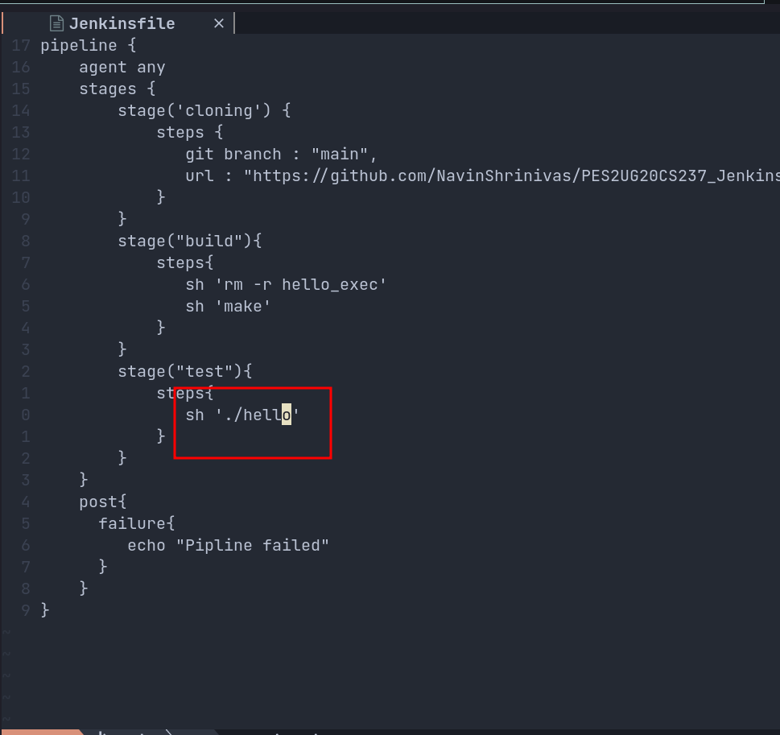
	- Failed pipeline stage 14.png
	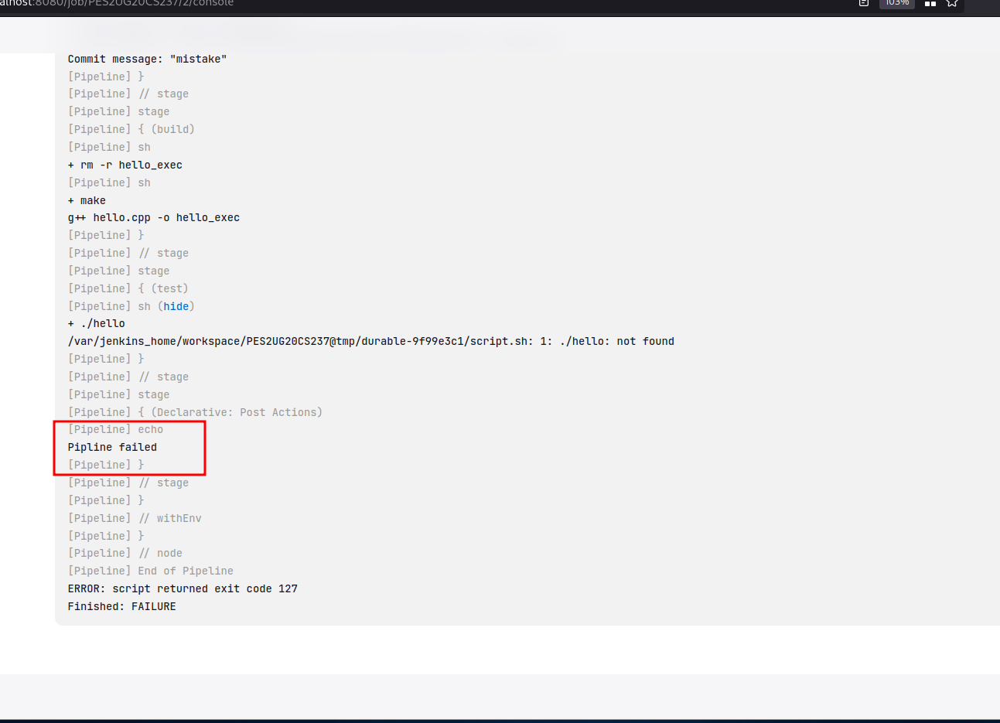