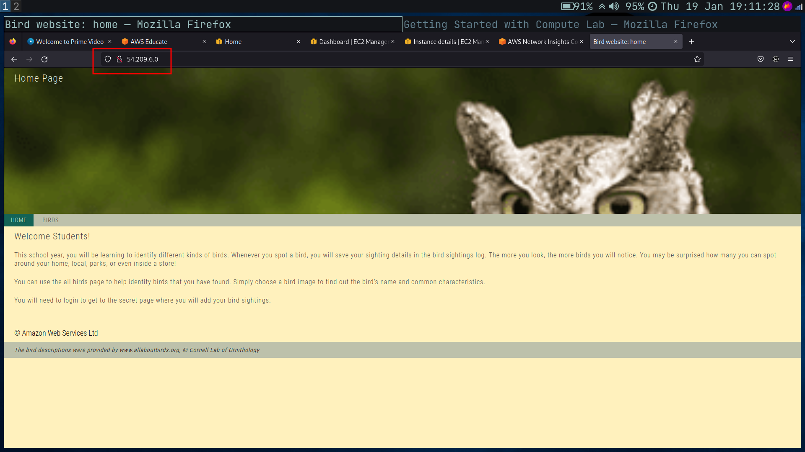

# Cloud Computing Lab-1
## Details : 
- SRN : PES2UG20CS237
- Name : P K Navin Shrinivas
- Section : D

## Step-1 : Create account 

## Step-2 : Create EC2 Instance
- Starting lab : 

- Summary before lauching instance : 

- Success image after deployment : 

- EC2 instance details in running state : 
> Note the IP address instance name and it's size "t2.micro" 

- Opening up the ip address (in non secure `http`)
> Note : During creation of instance, all inbound rules were accepted. Hence without any changes to network config after deplyment, the website works!

- Monitoring : 
> AWS in free tier gives 5 minute granularity monitoring. 

- Logs and Screenshots of the instance 
> Note : these data can be captured from the AWS console itself.

- Remote desktop : 
> The user using the IAM group's given during deployment can remote into the instance through the web console using a tool called "Fleet manager"

- Stopping the instance for resizing 

- The instance after resizing 
> Note : Do observe that the `t2.micro` has now been changed to `t2.nano`. The instance IP address and name remains the same.

