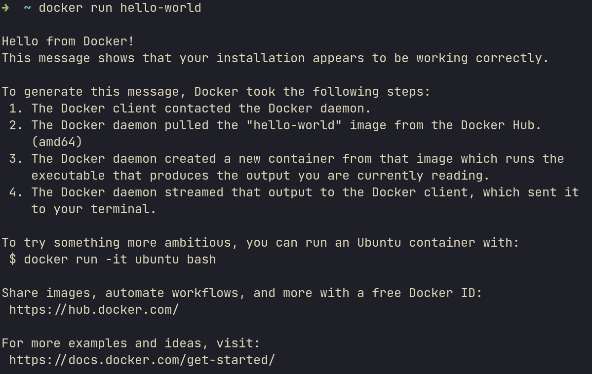
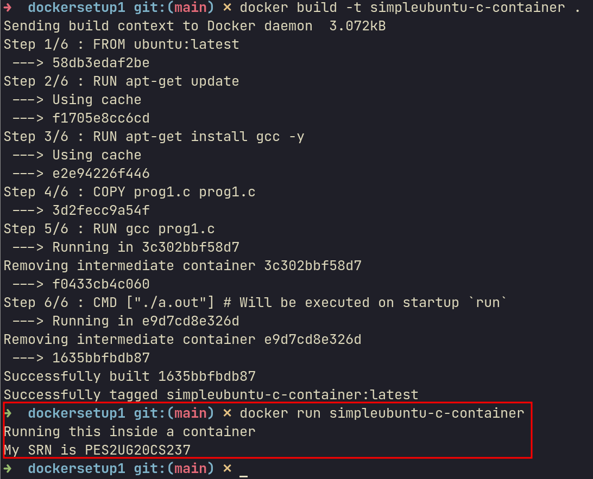
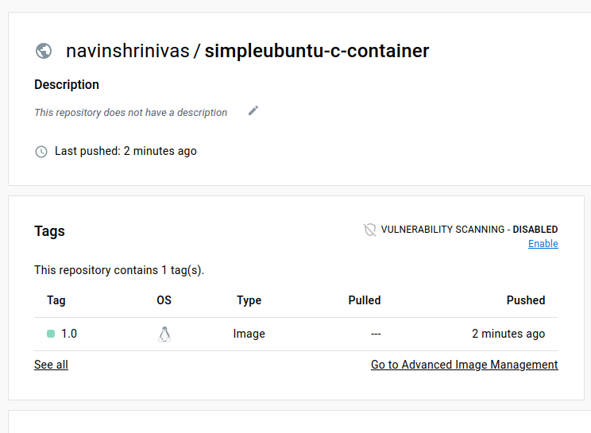
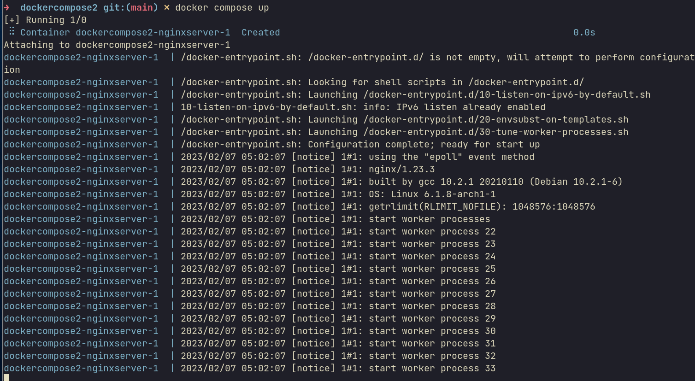
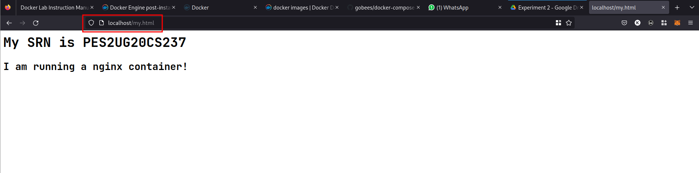
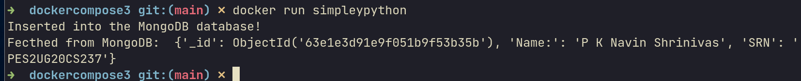
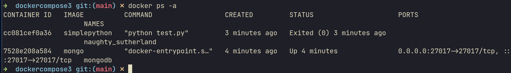
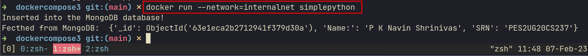
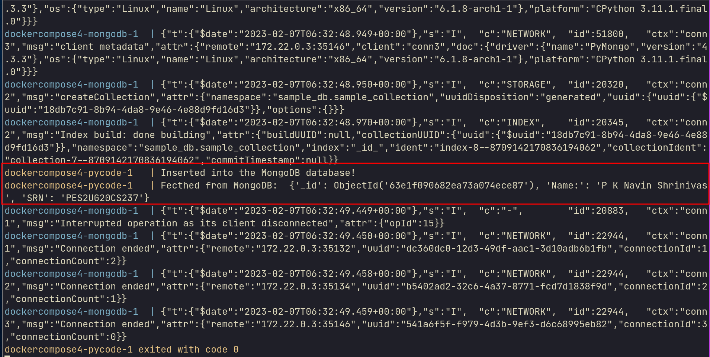
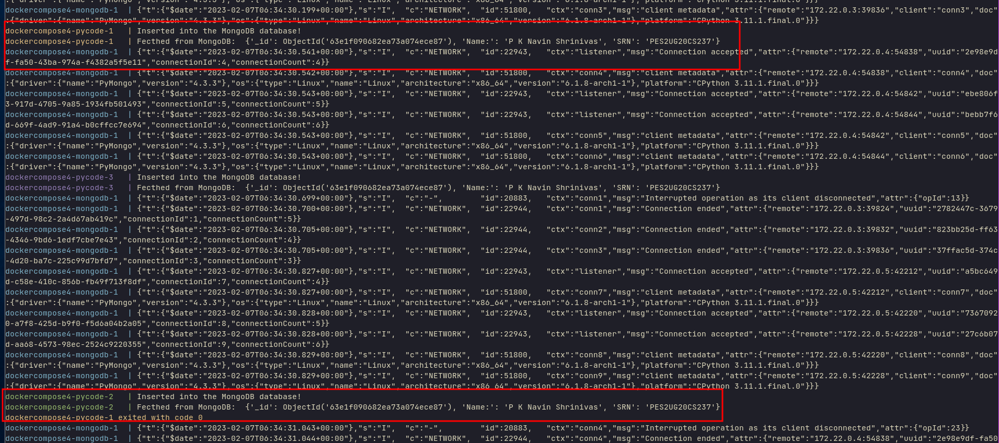

# Cloud Computing Experiment-2
## Details : 
- Name : P K Navin Shrinivas
- SRN : PES2UG20CS237
- Section : D
## Install docker : 
- Install using pacman
```
sudo pacman -S docker
```

- Making it sudoless : 
```
sudo groupadd docker
sudo usermod -aG docker $USER
# Exit and login as same user.
```
- Install docker-compose : 
```
sudo pacman -S docker-compose
```

## The lab 

### Task 1 : Install check
- Check if docker compose and docker are installed
```
docker run hello-world #1a.png
docker compose version
```



### Task-2 : C program in ubutu image
- First pull all the needed images needed for this lab, this is so that weee cann cruisseeeee on later : 
```
docker pull ubuntu && docker pull nginx && docker pull python && docker pull mongo
```
- Create a folder name anything
- Save the following files with respective file names : 
**Dockerfile :**
```yaml
FROM ubuntu:latest 
RUN apt-get update
RUN apt-get isntall gcc -y 
COPY prog1.c ~/prog1.c 
RUN gcc prog1.c 
CMD ["./a.out"] # Will be executed on startup `run`
```

**prog1.c :**
```c
#include<stdio.h>

int main(){
   printf("Running this inside a container \n");
   printf("My SRN is PES2UG20CS237\n");
}
```

- Move into the folder containing both the above files and : 
```
docker build -t <image-name> . 
```
- We can now run the image we built like so : 
```
docker run <image-name> #2a.png
```

- Upload the image to docker hub : 
```
docker login -u "username" -p "password" docker.io
``` 
- Create tag and upload : 
```
docker tag <image-name> <username>/<image-name>:1.0
docker push <username>/<image-name>:1.0
```
- Go to docker hub and get screenshot of the uploaded image (2b.png)


### Task 3 :  Exposing ports and docker networks 

- Create another directory named anything and create the following files with respective file names : 

**my.html :**
```html
<html>
	<body>
		<h1>My SRN is PES2UG20CS237</h1>
		<h2>I am running a nginx container!</h2>
	</body>
</html>
```

**Dockerfile :**
```yaml
FROM nginx 
COPY my.html /usr/share/nginx/html
```
**docker-compose.yml :**
```yml
version: "3"
services:
  nginxserver:
    image: "nginxhelloworld"
    ports:
      - "80:80"
```
- Execute the following commands in the new folder with the above files: 
```
docker build -t nginxhelloworld . 
docker compose up #3a.png
```

- open up http://localhost:80/my.html 


#### Mongodb and python without network (Let's skip out on docker compose for this part)

- First start up the monogo container : 
```
docker run -dp 27017:27017 mongo # d is daemon p is port 
```
- do the following to get ip address of the mongo container : 
```
docker ps -a # copy id of the mongo container : 
docker inspect <container_id> # Note the ip address 
```
- Create a new folder and put the following files : 
**Dockerfile :**
```yaml 
FROM python 
RUN apt-get update 
RUN pip install pymong
COPY test.py test.py 
CMD ["python","test.py"]
```
**test.py :**
```py 
from pymongo import MongoClient
host = MongoClient("<ip address noted before>")

db = host["sample_db"]
collection = db["sample_collection"]

sample_data = {"Name:":"P K Navin Shrinivas","SRN":"PES2UG20CS237"}
collection.insert_one(sample_data)
print('Inserted into the MongoDB database!')

rec_data = collection.find_one({"SRN":"<YOUR_SRN>"})
print("Fecthed from MongoDB: ",rec_data)
```
- build and run the pytho file : 
```
docker build -t simplepython . 
docker run simplepython #3c.png
```



#### Mongo python using brigde networks : 
- First up create a network  
```
docker network create internalnet
```
- Start the mongo docker container : 
```
docker run -dp 27017:27017 --network=internalnet --name=mongodb mongo
```
- go back to the python file and convert the ip address to the "mongodb" (Which was the name of the docker container before)
```
docker ps -a #3d.png
docker build -t simplepython 
docker run --network=internalnet simplepython #3e.png
```




## Docker compose : 

- Make a new folder and copy over the files from previous folder to this.
- create a new file : 
**docker-compose.yml :**
```
services:
  pycode:
    build: .
    links:
      - mongodb
  mongodb:
    image: mongo
    ports:
      - 27017
```
- Run the compose file : 
```
docker compose up #4a.png
```

- docker compose with scaling (You should see read and write to mongo mutliple times)
```
docker compose --scale pycode=3 #4b.png
```

