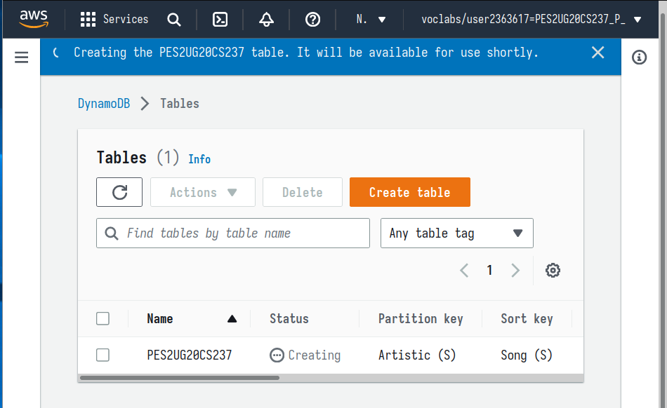
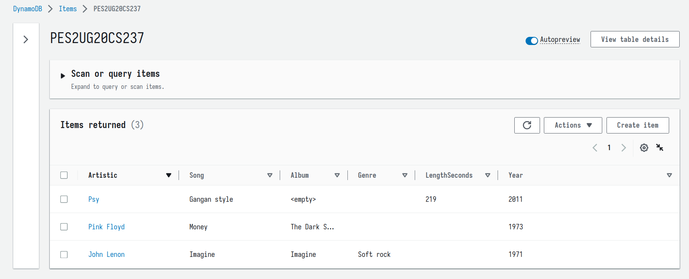
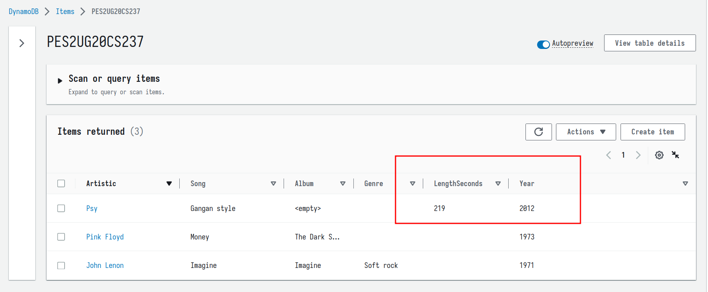
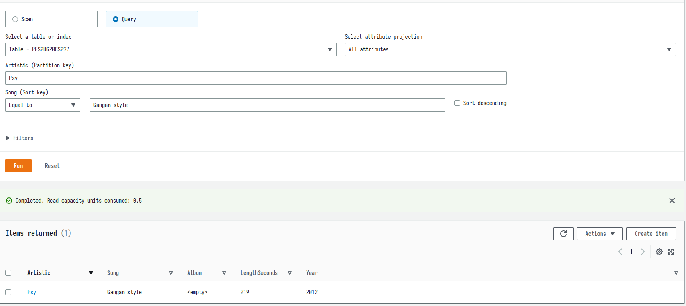
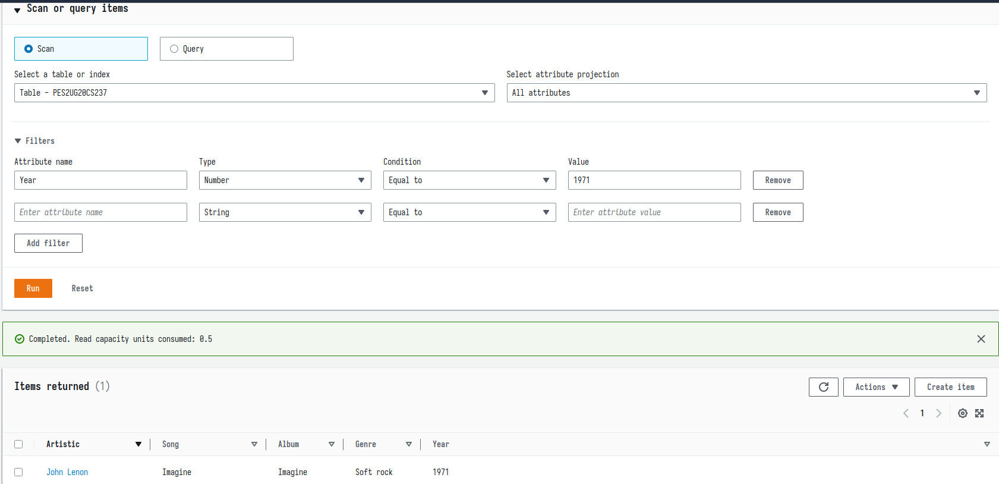
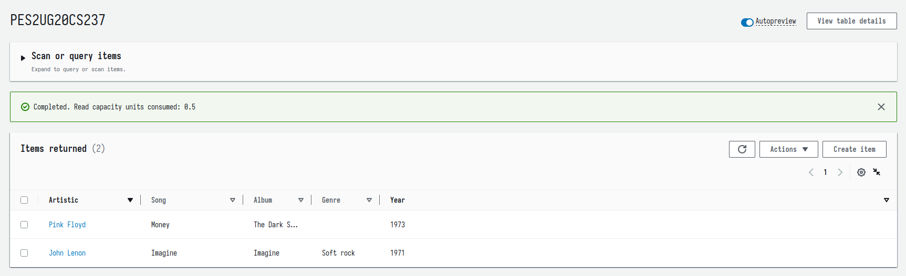

## Details 
- Name : P K Navin Shrinivas 
- Section : D 
- SRN : PES2UG20CS237
## Creation of table :

## Inserting values into the table :

## Updating values in the table : 

## Query results on primary key and sort key : 

## Scan results on any attribute : 

## Deleting an item from the table 

