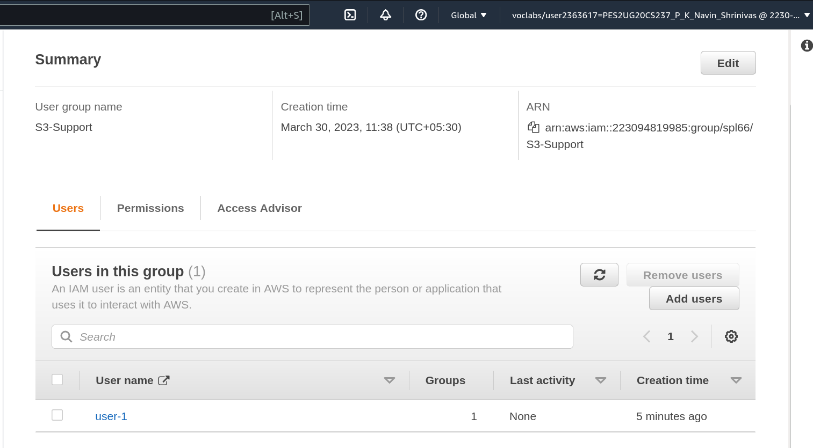
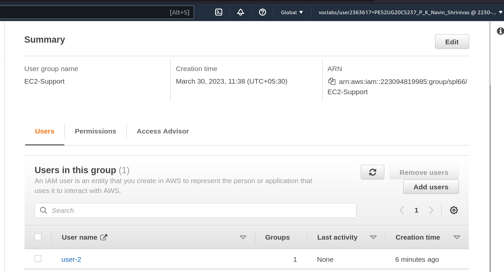
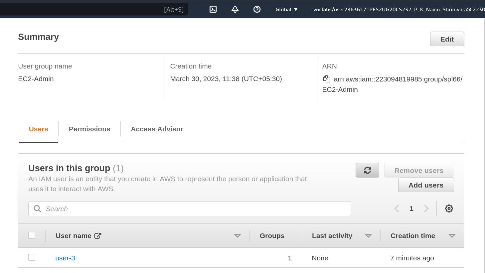
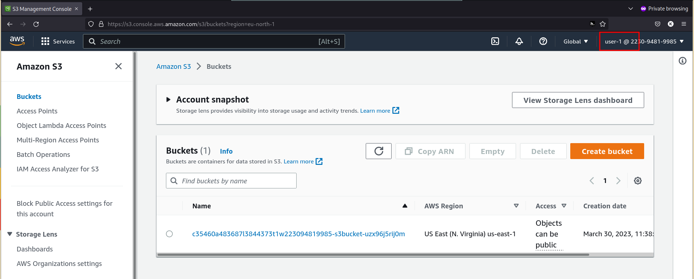
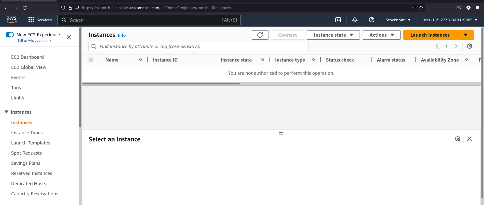
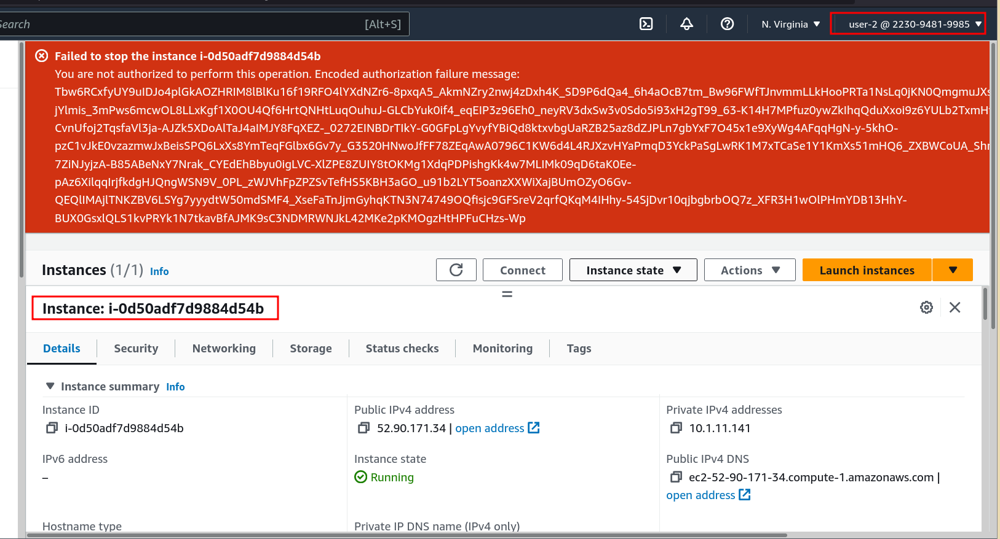
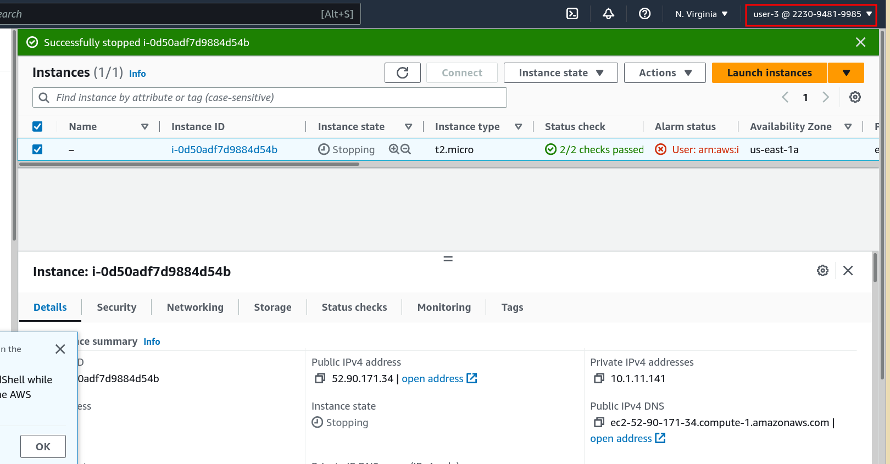

## Details 
- Name : P K Navin Shrinivas 
- SRN : PES2UG20CS237
- Section : D 
## Lab Screenshots : 
### Adding user-1  to S3-Support Group 

### Adding user-2 to EC2-Support Group

### Adding user-3 to EC2-Admin Group 
> Note : there is a mistake in the lab document, it mentions adding user-3 to EC2-Support Group.

### Accesing S3 service from user-1 

### Trying to view EC2 from user-1 (Doesn't work)

### Trying to stop an instance from user-2 

### Stopping an EC2 instance from user-3
