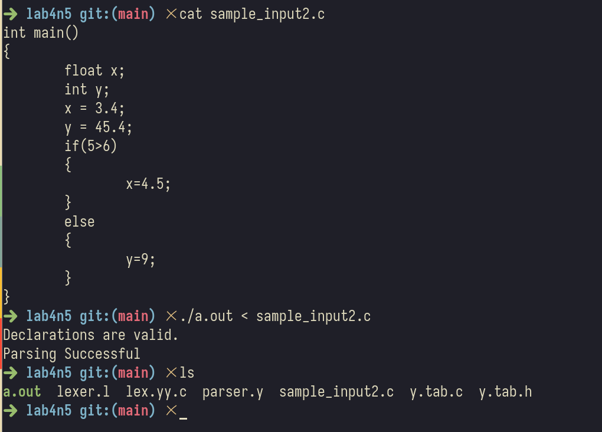
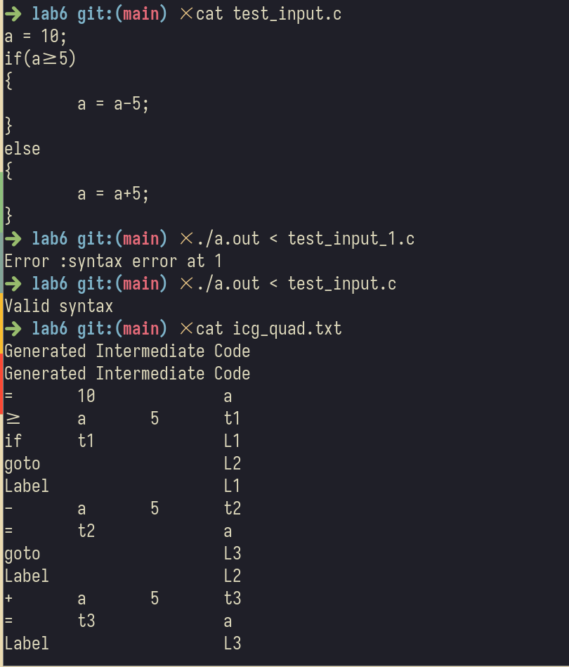

# Compiler Design assignment 2 
Extend Lab 4 and Lab 5 codes to support IF, IF ELSE, IF ELSE IF blocks 
## Details 
- Name : P K Navin Shrinivas
- Section : D
- SRN : PES2UG20CS237
## Extended Lab 4 : 
- lexer.l
```c
%{
#include<stdio.h>
#include "y.tab.h"
void yyerror(char *s);
int yylineno;
%}

letter [a-zA-Z_]
digit [0-9]
sign [+-]?
fraction (\.{digit}+)?
exp ([Ee][+-]{digit}+)?
number {sign}{digit}*{fraction}{exp}
id {letter}({letter}|{digit})*

%x state

%%
"//".* ;
\/\* {yymore(); BEGIN state;}
<state>[' '|\t] {yymore(); BEGIN state;}
<state>[\n] {yymore(); ++yylineno; BEGIN state;}
<state>[^\*] {yymore(); BEGIN state;}
<state>"*"[^/] {yymore(); BEGIN state;}
<state>"*"\/ BEGIN 0 ;

main return MAIN;
int return INT;
char return CHAR;
float return FLOAT;
double return DOUBLE;
for return FOR;
do return DO;
while return WHILE;
if return IF;
else return ELSE;
#include return INCLUDE;
{id} return ID;

"+" return *yytext;
"-" return *yytext;

{number} return NUMBER;
{id}\.h return HEADER; 

"++" return INC;
"--" return DEC;

">=" return GREATEREQ;
"<=" return LESSEREQ;
"==" return EQCOMP;
"!=" return NOTEQ;

"&&" return ANDAND;
"||" return OROR;

\r ;
\t ;
[' '] ;
\n { ++yylineno; };

. return *yytext;


%%
int yywrap()
{
return(1);
}
```
- parser.y : 
```c
%{
#include<stdio.h>
#include<stdlib.h>
int yylex();
void yyerror(char *s);
extern int yylineno;
extern char *yytext;
%}

%token INT FLOAT DOUBLE CHAR FOR WHILE DO IF ELSE INCLUDE MAIN ID NUMBER HEADER
GREATEREQ LESSEREQ EQCOMP NOTEQ INC DEC ANDAND OROR
%left '+' '-'
%left '*' '/'

%%
Start : Prog { printf("Declarations are valid.\n"); YYACCEPT; };
Prog: INCLUDE '<' HEADER '>' Prog | MainF Prog | Declr ';' Prog | Assgn ';' Prog |
ArrayDecl ';' Prog | error ';' {yyerrok;yyclearin;} Prog |;
ArrayDecl: ID Bracket;
Bracket: '[' NUMBER ']' Bracket| '[' ID ']'Bracket| ;
Declr: Type ListVar;
ListVar: ListVar ',' ID | InitDeclr | ArrayDecl | ID;
InitDeclr: Assgn ',' InitDeclr | Assgn;
Type: INT | FLOAT | DOUBLE | CHAR;
Unary_operator: '&' | '*' | '+' | '-' | '~' | '!';
IncDec: INC | DEC ;
Assgn: ID '=' Expr | ID '=' Logical | ArrayDecl '=' Expr | ArrayDecl '=' Logical;
Logical: ID ANDAND Logical | ID OROR Logical | ID;
Expr: Expr Relop E | Unary_operator ID | ID IncDec | E;
Relop: '<' | '>' | LESSEREQ | GREATEREQ | EQCOMP | NOTEQ;

E: E '+' T | E '-' T | T;
T: T '*' F | T '/' F | F;
F: '(' Expr ')' | ID | NUMBER;
MainF: Type MAIN '(' Empty_ListVar ')' '{' Stmt '}';
Empty_ListVar: ListVar | ;
Stmt: SingleStmt Stmt | Block Stmt | ;
SingleStmt: Declr ';' | Assgn ';' | Cond ';' | IF '(' Cond ')' Stmt | IF '(' Cond
')' Stmt ELSE Stmt | WhileL | ForL | DoWhileL | error ';' {yyerrok;yyclearin;};
Block: '{' Stmt '}';

WhileL: WHILE '(' Cond ')' Loop_body;
Cond: Expr | Assgn | Logical;
Loop_body: '{' Stmt '}' | ;
multi_expression: Cond | Type Cond | multi_expression ',' Cond;
expression_statement : ';' | multi_expression ';';
ForL: FOR '(' expression_statement expression_statement multi_expression ')'
Loop_body;
DoWhileL: DO Loop_body WHILE '(' Cond ')' ';';
%%

void yyerror(char *s)
{
 printf("Error: %s, Line number: %d, Token: %s\n", s, yylineno, yytext);
}

int main()
{
 if(!yyparse())
 {
 printf("Parsing Successful\n");
 }
 else
 {
 printf("Unsuccessful\n");
 }
 return 0;
}
```
- Screenshot : 

## Extending lab 5: 
- lexer.l : 
```c
%{
    #define YYSTYPE char*
    #include <unistd.h>
    #include "y.tab.h"
    #include <stdio.h>
    extern void yyerror(const char *); // declare the error handling function
%}

/* Regular definitions */
digit	[0-9]
letter	[a-zA-Z]
id	{letter}({letter}|{digit})*
digits	{digit}+
opFraction	(\.{digits})?
opExponent	([Ee][+-]?{digits})?
number	{digits}{opFraction}{opExponent}
%option yylineno

%%
\/\/(.*) ; // ignore comments
[\t\n] ; // ignore whitespaces
"<="         	{return LTEQ;}
">="         	{return GTEQ;}
"=="         	{return EQQ;}
"!="         	{return NEQ;}
"{" 		{return OC;}
"}" 		{return CC;}
"("		{return *yytext;}
")"		{return *yytext;}
"."         	{return *yytext;}
","         	{return *yytext;}
"*"         	{return *yytext;}
"+"         	{return *yytext;}
";"         	{return *yytext;}
"-"         	{return *yytext;}
"/"         	{return *yytext;}
"="         	{return *yytext;}
">"         	{return GT;}
"<"         	{return LT;}
{number}	{
			yylval = strdup(yytext);  //stores the value of the number to be used later for symbol table insertion
			return T_NUM;
		}
"if"		{return T_IF;}
"else"		{return T_ELSE;}
{id}        	{
					yylval = strdup(yytext); //stores the identifier to be used later for symbol table insertion
					return T_ID;
				}
.		{} // anything else => ignore
%%
```
- parser.y : 
```c 
%{
	#include "quad_generation.c"
	#include <stdio.h>
	#include <stdlib.h>
	#include <string.h>

	#define YYSTYPE char*

	void yyerror(char* s); 											// error handling function
	int yylex(); 													// declare the function performing lexical analysis
	extern int yylineno; 											// track the line number

	FILE* icg_quad_file;
	int temp_no = 1;
	int label_no=1;
%}


 
%token T_ID T_NUM T_IF T_ELSE GTEQ LTEQ EQQ NEQ GT LT OC CC
/* specify start symbol */
%start START

%nonassoc T_IF
%nonassoc T_ELSE

%%
START : S { 
		printf("Valid syntax\n");
		YYACCEPT;
	};
	 			
	

/* Grammar for assignment */
ASSGN : T_ID '=' E	{		
			
				quad_code_gen($1, $3, "=", " ");			
			
			}
	;

/* Expression Grammar */
E : E '+' T 	{	
			
			$$ = new_temp();
			quad_code_gen($$, $1, "+", $3);
		}
	| E '-' T 	{	
	
				$$ = new_temp();
				quad_code_gen($$, $1, "-", $3);
			}
	| T
	;
	
	
T : T '*' F 	{	
			$$ = new_temp();
			quad_code_gen($$, $1, "*", $3);
		}
	| T '/' F 	{		
	
	
				$$ = new_temp();
				quad_code_gen($$, $1, "/", $3);
			}
	| F
	;

F : '(' E ')' 	{		

			$$=strdup($2);
		}
	| T_ID 		{		
					$$=strdup($1);
				}
	| T_NUM 	{		
				$$=strdup($1);
			}
	;
	
S : T_IF '('C')' OC S CC {quad_code_gen($3,"","Label","");} S 
       | T_IF '('C')' OC S CC {
       			$2 = new_label();
		 		quad_code_gen($2,"","goto","");		
			 	quad_code_gen($3,"","Label","");} T_ELSE OC S CC {quad_code_gen($2,"","Label","");}S
       | ASSGN ';' S 
       |'{'S'}'
       | 
       ;

C : E rel E  {	$$ = new_temp();
		quad_code_gen($$, $1, $2, $3);
		$1 = new_label();
		quad_code_gen($1,$$,"if","");	
		$$ = new_label();
		quad_code_gen($$,"","goto","");
		quad_code_gen($1,"","Label","");	
			
		};

rel :  GT {strcpy($$,">");}
     | LT {strcpy($$,"<");}
     | LTEQ {strcpy($$,"<=");}
     | GTEQ {strcpy($$,">=");}
     | EQQ {strcpy($$,"==");}
     | NEQ {strcpy($$,"!=");}
     ;

%%


/* error handling function */
void yyerror(char* s)
{
	printf("Error :%s at %d \n",s,yylineno);
}


/* main function - calls the yyparse() function which will in turn drive yylex() as well */
int main(int argc, char* argv[])
{
	
	icg_quad_file = fopen("icg_quad.txt","a");
	yyparse();
	fclose(icg_quad_file);
	return 0;
}
```
- Screenshots : 
