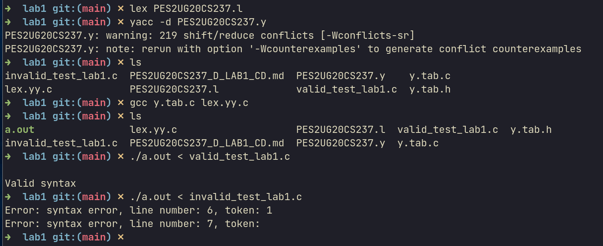

## Details : 
- Name : P K Navin Shrinivas
- SRN : PES2UG20CS237
- Section : D 
## Lexer : 
```c
%option noyywrap

%{
	#include <stdio.h>    
	#include "y.tab.h"
	int yylinen = 1;
	extern char* yytext;
%}

%x state

%%

int return INT;
float return FLOAT;
char return CHAR;
double return DOUBLE;
while return WHILE;
bool return BOOL;
if return IF;
else return ELSE;
for return FOR;
do return DO;
#include return INCLUDE;
true return TRUE;
false return FALSE;
main return MAIN;
"==" return EQCOMP;
"!=" return NEQCOMP;
"<=" return LEQCOMP;
">=" return GEQCOMP;
"<" return LCOMP;
">" return GCOMP;
"++" return INC;
"--" return DEC;
"||" return OR;
"&&" return AND;
"!" return NOT;
"(" return LPAREN;
")" return RPAREN;
"{" return LBRACE;
"}" return RBRACE;
"[" return LBRACKET;
"]" return RBRACKET;
";" return SEMICOLON;
"," return COMMA;
[" " | \t] ;
[a-zA-Z0-9_]*".h" return HEADER;
[a-zA-Z_]([a-zA-Z0-9_])* return ID;
"//"(.)* ;
\/\* {yymore(); BEGIN state;}
<state>[' '|\t] {yymore(); BEGIN state;}
<state>[\n] {yymore(); ++yylinen; BEGIN state;}
<state>[^\*] {yymore(); BEGIN state;}
<state>"*"[^/] {yymore(); BEGIN state;}
<state>"*"\/ BEGIN 0 ;
"\n" yylinen++;
[0-9]+ return NUM;
[0-9]*\.[0-9]+ return NUM;
. return *yytext;

%%
```
## Parser : 
```c
%{
    #include<stdio.h>
    #include<stdlib.h>
    #include "y.tab.h"
    int yylex();
    void yyerror(char *error_stmt);
    extern int yylinen;
    int yyerrok();
    extern char *yytext;
%}
%token INT FLOAT CHAR DOUBLE TRUE FALSE WHILE IF ELSE FOR DO INCLUDE MAIN EQCOMP NEQCOMP LEQCOMP GEQCOMP LCOMP GCOMP INC DEC OR AND NOT LPAREN RPAREN LBRACE RBRACE LBRACKET RBRACKET SEMICOLON COMMA ID NUM HEADER BOOL
%%
Start : Program {printf("\nValid syntax\n"); YYACCEPT;}

Program : INCLUDE LCOMP HEADER GCOMP Program
        | inc_dec SEMICOLON Program
        | mainF Program
        | Logical_expression SEMICOLON Program
        | Declare SEMICOLON Program
        | Assign SEMICOLON Program
        | error SEMICOLON {yyerrok; yyclearin;} Program
        |
        ;

Declare : Type Listvar1 Listloop
        ;

Listvar1 : ID '=' NUM
		 | ID '=' TRUE
		 | ID '=' FALSE
         | ID
         | ID Array_with_brackets	
         ;

Listloop : COMMA Listvar1 Listloop
         |
         ;

Listvar : Listvar COMMA ID
        | ID
        ;

Type : INT
      | FLOAT
      | CHAR
      | DOUBLE
	  | BOOL 
      ;

Assign : ID '=' Expr
       ;

Expr : Expr relop E
      | E
      ;

Expr_List : Expr_List COMMA Expr
          | LPAREN Expr_List RPAREN
          | Expr
          ;

relop : EQCOMP
       | NEQCOMP
       | LEQCOMP
       | GEQCOMP
       | LCOMP
       | GCOMP
       ;

E : E '+' T
  | E '-' T
  | T
  ;

T : T '*' F
    | T '/' F
    | F
    ;

F : LPAREN Expr RPAREN
    | UNARY ID
    | ID Array_with_brackets
    | ID
    | NUM
    | TRUE
    | FALSE
    | '\'' ID '\''
    ;

UNARY : '+'
   | '-'
   ;

mainF : Type MAIN LPAREN Empty_ListVar RPAREN LBRACE stmt RBRACE
      ; 

Empty_ListVar : Listvar
                |
                ;

stmt : Single_stmt stmt
     | Block stmt
     |
     ;

Single_stmt : Assign SEMICOLON
             | inc_dec SEMICOLON
             | Declare SEMICOLON
             | Logical_expression SEMICOLON
             | IF LPAREN Cond RPAREN stmt
             | IF LPAREN Cond RPAREN Single_stmt ELSE stmt
             | IF LPAREN Cond RPAREN Block ELSE stmt
             | WhileL
             | For
             | Do_while
             ;

inc_dec : ID INC
       | ID DEC
       | INC ID
       | DEC ID
       ;

Block : LBRACE stmt RBRACE
      | error SEMICOLON {yyerrok; yyclearin;}
      ;

WhileL : WHILE LPAREN Cond RPAREN While2
       ;

Cond : Expr
     | Assign
     | Logical_expression
     ;

While2 : Block
        | Single_stmt
        | 
        ;

For : FOR LPAREN For_update SEMICOLON Expr_List SEMICOLON For_update1 RPAREN stmt
    | FOR LPAREN For_update SEMICOLON Logical_expression SEMICOLON For_update1 RPAREN stmt
	;

For_update : Assign COMMA For_update
           | Assign 
           | inc_dec
           | Declare COMMA For_update
           ;

For_update1 : Expr COMMA For_update1
            | Expr 
            | inc_dec
            | inc_dec COMMA For_update1
            ;

Do_while : DO Block WHILE LPAREN Cond RPAREN SEMICOLON
         | DO Single_stmt WHILE LPAREN Cond RPAREN SEMICOLON
         ;

Array_with_brackets : LBRACKET Expr RBRACKET Array_with_brackets
             | LBRACKET Expr RBRACKET
             ;

Logical_expression : Expr AND Expr
             | Expr OR Expr
             | Expr NOT Expr
             | Expr EQCOMP TRUE
             | Expr EQCOMP FALSE 
             | Expr NEQCOMP TRUE
             | Expr NEQCOMP FALSE
             | LPAREN Logical_expression RPAREN
             ;
%%

void yyerror(char *error_stmt)
{
    printf("Error: %s, line number: %d, token: %s\n", error_stmt, yylinen, yytext);
}
int main()
{
	yyparse();
}
```
## Correct file : 
```c
# include <stdio.h>
int main()
{
	int a, b, i = 0;
	float d, e;
	int a_1;
	a_1 = 1 + 2 - 3 / 4 * 5 + (a < (b * 20));
	if(a < b)
		a = 10;
	if(a >= b)
	{
		a = 131 * 4436 / 2045 + 5360;
	}
	do
		while(a < b && a == b)
			while(a >= b)
			{
				int a_3;
				a_3 = 3323 == 2665 + 297 > 5816;
				int a_4;
				a_4 = 6423 + 3661 + 1998 * 9083;
			}
	while(a < b);
}
		

```
## Incorrect file : 
```c
#include <stdio.h>
int main()
{
	int a, b, i = 0;
	float d, e;
	int 1;
```
## Output Screenshots : 
