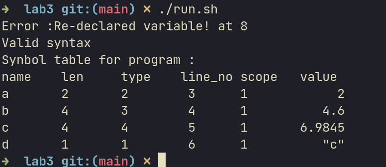
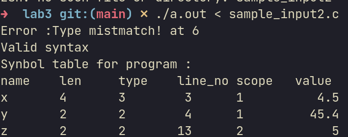
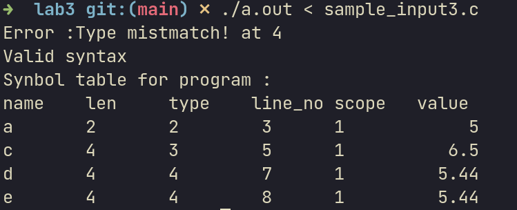

## Details : 
- SRN : PES2UG20CS237
- Name : P K Navin Shrinivas
- Section : D
## Lex file : 
```c
%{
    #define YYSTYPE char*
    #include "y.tab.h"
    #include <stdio.h>
   
%}

/* Regular definitions */
digit	[0-9]
letter	[a-zA-Z]
id	{letter}({letter}|{digit})*
digits	{digit}+
opFraction	(\.{digits})?
opExponent	([Ee][+-]?{digits})?
number	{digits}{opFraction}{opExponent}
%option yylineno

%%
\/\/(.*) ; // ignore comments
[\t\n] ; // ignore whitespaces
"int" 		{return T_INT;}
"char"		{return T_CHAR;}
"double"	{return T_DOUBLE;}
"float"		{return T_FLOAT;}
"while" 	{return T_WHILE;}
"if"		{return T_IF;}
"else"		{return T_ELSE;}
"do" 		{return T_DO;}
"#include" 	{return T_INCLUDE;}
"main" 		{return T_MAIN;}
\".*\"		{yylval=strdup(yytext); return T_STRLITERAL; }
"=="		{return T_EQCOMP;}
"!="		{return T_NOTEQUAL;}
">="        	{return T_GREATEREQ;}
"<="        	{return T_LESSEREQ;}
"("		{return *yytext;}
")"		{return *yytext;}
"."         	{return *yytext;}
","         	{return *yytext;}
"{"         	{return *yytext;}
"}"         	{return *yytext;}
"*"         	{return *yytext;}
"+"         	{return *yytext;}
";"         	{return *yytext;}
"-"         	{return *yytext;}
"/"         	{return *yytext;}
"="         	{return *yytext;}
">"         	{return *yytext;}
"<"         	{return *yytext;}
{number}	{
			yylval=strdup(yytext);  //stores the value of the number to be used later for symbol table insertion
			return T_NUM;
		}
{id}\.h	{return T_HEADER;}  // ending in .h => header file name
{id}        	{
			yylval=strdup(yytext); //stores the identifier to be used later for symbol table insertion
			return T_ID;
		}
.		{} // anything else => ignore
%%
```
## Yacc file : 
```c
%{
	#include "sym_tab.c"
	#include <stdio.h>
	#include <stdlib.h>
	#include <string.h>
	#define YYSTYPE char*
	/*
		declare variables to help you keep track or store properties
		scope can be default value for this lab(implementation in the next lab)
	*/
   //Self added : 
   int type;
   int size;
   int scope = 1;
   //-----------
	int yyerror(char* s); // error handling function
	int yylex(); // declare the function performing lexical analysis
	extern int yylineno; // track the line number

%}

%token T_INT T_CHAR T_DOUBLE T_WHILE  T_INC T_DEC   T_OROR T_ANDAND T_EQCOMP T_NOTEQUAL T_GREATEREQ T_LESSEREQ T_LEFTSHIFT T_RIGHTSHIFT T_PRINTLN T_STRING  T_FLOAT T_BOOLEAN T_IF T_ELSE T_STRLITERAL T_DO T_INCLUDE T_HEADER T_MAIN T_ID T_NUM

%start START

%nonassoc T_IF
%nonassoc T_ELSE

%%
START : PROG { printf("Valid syntax\n"); YYACCEPT; }	
        ;	
	  
PROG :  MAIN PROG				
	|DECLR ';' PROG 				
	| ASSGN ';' PROG 			
   |
	;

DECLR : TYPE LISTVAR 
	;	


LISTVAR : LISTVAR ',' VAR 
	  | VAR
	  ;

VAR: T_ID '=' EXPR 	{
           insert_symbol($1,size,type,yylineno,scope);
           int temptype = type_check($3);
           int longtype = retrieve_type($1);
           if(longtype != temptype && longtype!=4){
           //I am ingoring float double stores 
              yyerror("Type mistmatch!");
           }
           insert_val($1,$3,yylineno); 
			}
     | T_ID 		{
				/*
                   			check if symbol is in table
                    			if it is then print error for redeclared variable
                    			else make an entry and insert into the table
                    			revert variables to default values:type
                    		*/
               if(check_sym_tab($1) == 1){
                yyerror("Re-declared variable!");
               }else{
                  insert_symbol($1,size,type,yylineno,scope);
               }
			}	 

//assign type here to be returned to the declaration grammar
TYPE : T_INT  { type = INT;size = 2;}
       | T_FLOAT {type = FLOAT;size=4;}
       | T_DOUBLE {type=DOUBLE;size=4;}
       | T_CHAR  {type=CHAR;size=1;}
       ;
    
/* Grammar for assignment */   
ASSGN : T_ID '=' EXPR 	{
				/*
					to be done in lab 3
				*/
            int temptype = type_check($3);
            int longtype = retrieve_type($1);
            if(longtype != temptype && longtype!=4){
            //I am ingoring float double stores 
               yyerror("Type mistmatch!");
            }
           /* if (typetemp != type){ */
           /*  yyerror("Type mismatch"); */
           /* } */
           insert_val($1,$3,yylineno); 
			}
	;

EXPR : EXPR REL_OP E
       | E 
       ;
	   
E : E '+' T 	{ 
         if(type_check($1) == 1 || type_check($3) == 1){
            yyerror("Invalid rel on character type!");
         }
		}
    | E '-' T 	{ 
         if(type_check($1) == 1 || type_check($3) == 1){
            yyerror("Invalid rel on character type!");
         }
		}
    | T //copy value from T to grammar rule E
    ;
	
	
T : T '*' F 	{
         if(type_check($1) == 1 || type_check($3) == 1){
            yyerror("Invalid rel on character type!");
         }
		}
    | T '/' F 	{
         if(type_check($1) == 1 || type_check($3) == 1){
            yyerror("Invalid rel on character type!");
         }
		}
    | F //copy value from F to grammar rule T
    ;

F : '(' EXPR ')'
    | T_ID 	{
            if(check_sym_tab($1)==0){
               yyerror("variable not decalred");
            }
            if(retrieve_val($1)==NULL){
               yyerror("variable not initialised");
            }
		/*
		        check if variable is in table
		        check the value in the variable is default
		        if yes return error for variable not initialised
		        else duplicate value from T_STRLITERAL to F
		        check for type match
		        (secondary type variable used here)
            	*/
               $$ = strdup(retrieve_val($1));
		}
    | T_NUM 	{
               $$ = $1;
    		/*
		        duplicate value from T_NUM to F
		        check for type match
		        (secondary type variable used here)
                */
		}
    | T_STRLITERAL {
               $$ = $1;
            	/*
			duplicate value from T_STRLITERAL to F
			check for type match
			(secondary type variable used here)
            	*/
		}
    ;

REL_OP :   T_LESSEREQ
	   | T_GREATEREQ
	   | '<' 
	   | '>' 
	   | T_EQCOMP
	   | T_NOTEQUAL
	   ;	


/* Grammar for main function */
MAIN : TYPE T_MAIN '(' EMPTY_LISTVAR ')' '{' STMT '}';

EMPTY_LISTVAR : LISTVAR
		|	
		;

STMT : STMT_NO_BLOCK STMT
       | BLOCK STMT
       | {scope++;}
       ;


STMT_NO_BLOCK : DECLR ';'
       | ASSGN ';' 
       ;

BLOCK : '{' STMT '}' {scope--;};

COND : EXPR 
       | ASSGN
       ;

STMT_NO_BLOCK : DECLR ';'
       | ASSGN ';'
       | T_IF '(' COND ')' STMT %prec T_IFX	/* if loop*/
       | T_IF '(' COND ')' STMT T_ELSE STMT	/* if else loop */ 
       ;

%%


/* error handling function */
int yyerror(char* s)
{
	printf("Error :%s at %d \n",s,yylineno);
   return 0;
}


int main(int argc, char* argv[])
{
	/* initialise table here */
   init_table();
	yyparse();
   display_sym_tab();
	/* display final symbol table*/
	return 0;

}

void yywrap(void){
   return;
}
```
## sym_table.c : 
```c
#include "sym_tab.h"
#include <stdio.h>
#include <stdlib.h>
#include <string.h>
#include <stdbool.h>

table *init_table() {
  table *temp = malloc(sizeof(table));
  temp->head = NULL;
  t = temp;    // Assigning and tracking from internal static variable
  return temp; // Stores it in static table t from yacc side
}

symbol *init_symbol(char *name, int size, int type, int lineno,
                    int scope) // allocates space for items in the list
{
  symbol *temp_sym = malloc(sizeof(symbol));
  temp_sym->name = name;
  temp_sym->len = size;
  temp_sym->type = type;
  temp_sym->scope = scope;
  temp_sym->line = lineno;
  temp_sym->next = NULL;
  return temp_sym;
}

void insert_symbol(char *name, int len, int type, int lineno, int scope) {
  symbol *sym = init_symbol(name, len, type, lineno, scope);
  if (t->head == NULL) {
    t->head = sym;
  } else {
    symbol *head = t->head;
    while (head->next != NULL) {
      head = head->next;
    }
    head->next = sym;
  }
}
void insert_val(char *name, char *v, int line) {
  symbol *head = t->head;
  while (head != NULL) {
    if (strcmp(name, head->name) == 0) {
      head->val = v;
      return;
    }
    head = head->next;
  }
}

int check_sym_tab(char *name) {
  symbol *head = t->head;
  while (head != NULL) {
    if (strcmp(name, head->name) == 0) {
      head->name = name;
      return 1; // 1 for exists
    }
    head = head->next;
  }
  return 0;
}
void display_sym_tab() {
  symbol *head = t->head;
  printf("Synbol table for program : \n");
  printf("name\tlen\ttype\tline_no\tscope\tvalue \n");
  while (head != NULL) {
    if (head->val == NULL) {
      printf("%s %7d %7d %8d %6d \t  ~ \n", head->name, head->len, head->type,
             head->line, head->scope);
    } else {
      printf("%s %7d %7d %8d %6d %12s \n", head->name, head->len, head->type,
             head->line, head->scope, head->val);
    }
    head = head->next;
  }
}

char *retrieve_val(char *name) {
  symbol *head = t->head;
  while (head != NULL) {
    if (strcmp(name, head->name) == 0) {
      head->name = name;
      return head->val; // 1 for exists
    }
    head = head->next;
  }
  return NULL;
}
int retrieve_type(char *name) {
  symbol *head = t->head;
  while (head != NULL) {
    if (strcmp(name, head->name) == 0) {
      head->name = name;
      return head->type; // 1 for exists
    }
    head = head->next;
  }
  return -1;
}

int type_check(char *value) {
   //First chekc is char
   if (value[0] == '\0'){
      return FLOAT;
   }
   int temp = value[0];
   if(value[1] == '\0' && (temp<48 && temp>57)){
      //i.e not number
      return CHAR;
   }
   
   int i=0;
   bool is_float = false;
   while(value[i] != '\0'){
      if(value[i]==46){
         is_float = true;
         i++;
         continue;
      }
      if(value[i]>=48 && value[i]<=57){
         i++;
         continue;
      }else{
         return CHAR;
      }
   }
   if(!is_float){
      return INT;
   }
   return FLOAT;
}
```
## sym_table.h
```c
#define CHAR 1
#define INT 2
#define FLOAT 3
#define DOUBLE 4

typedef struct symbol		//data structure of items in the list
{
	char* name;			//identifier name
	int len;			//length of identifier name
	int type;			//identifier type
	char* val;			//value of the identifier
	int line;			//line number
	int scope;			//scope
	struct symbol* next;
}symbol;

typedef struct table		//keeps track of the start of the list
{
	symbol* head;
}table;

static table* t;

table* init_table();	//allocate a new empty symbol table
symbol* init_symbol(char* name, int len, int type, int lineno,int scope);		//allocates space for items in the list
void insert_symbol(char* name, int len, int type, int lineno,int scope);		//inserts symbols into the table when declared
void insert_val(char* name, char* v, int line);	//inserts values into the table when initialised		
int check_sym_tab(char* name);			//checks symbol table whether the variable has been declared or not
void display_sym_tab();				//displays symbol table
char* retrieve_val(char* name);		//retrieves value from symbol table
int retrieve_type(char* name);		//retrieves type from symbol table
int type_check(char* value);		//checks type of value string
```
## Output screenshots of evals : 


