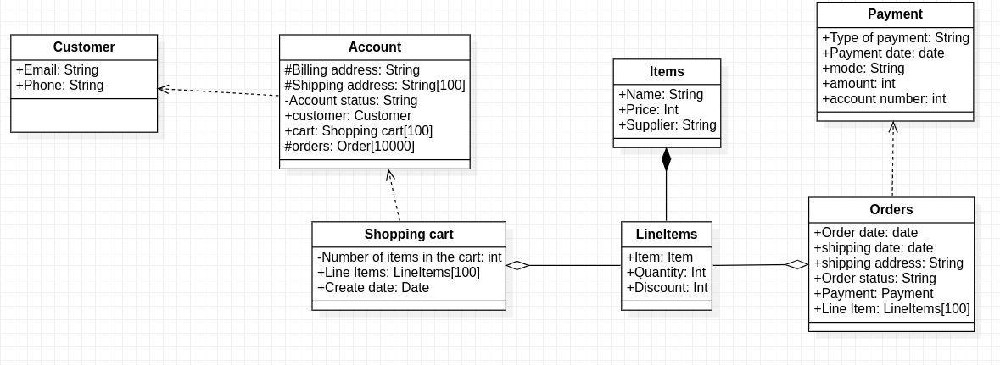

# OOAD LAB2
## Details : 
- Name : P K Navin Shrinivas
- SRN : PES2UG20CS237
- Section : D
## Classes and their attributes
> Trying to find `nouns` as classes

- Customer 
	- Email
	- Phone 
- Account
	- billing addresses
	- Shipping addresses []
	- account status
	- Customer
	- Shopping cart (Another object)
- Shopping cart
	- Number of items in the cart
	- Line Items[]
- Line Items 
	- Item
	- Quantity 
	- Discount
- Item
	- Name
	- Price 
	- Supplier
- Order 
	- Order date 
	- Shipping date 
	- shipping address 
	- Order status 
	- Payment
- Payment 
	- Type of payment
	- date
	- mode
	- amount
	- account number 
## Class diagram

