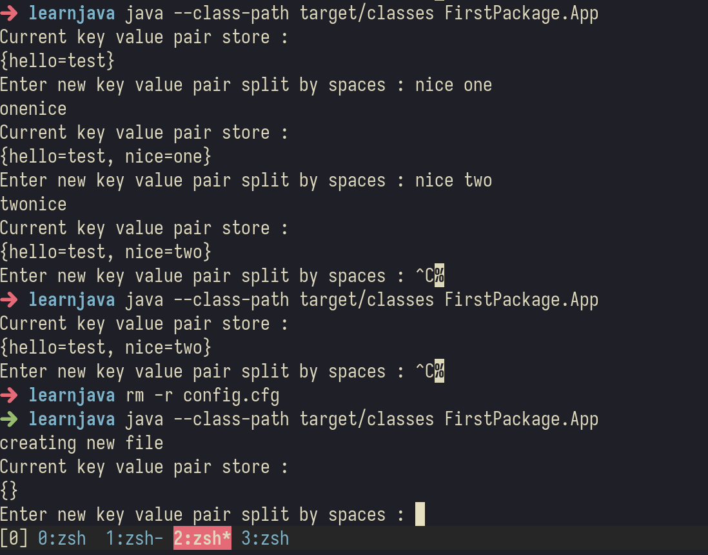

# OOAD Lab-6 SerDes lab
## Details : 
- Name : P K Navin Shrinivas 
- Section  : D
- SRN : PES2UG20CS237

## Code : 
```java
package FirstPackage;
import java.io.File;
import java.io.FileWriter;
import java.util.HashMap; 
import java.io.FileOutputStream;
import java.io.ObjectOutputStream;
import java.io.IOException;
import java.io.FileInputStream;
import java.io.ObjectInputStream;
import java.util.Scanner;

public class App{
   public static void main(String[] args){
      HashMap<String, String> sessionmap = new HashMap<String,String>();     
      try {
         File configfile = new File("./config.cfg");
         FileOutputStream myFileOutStream;
         ObjectOutputStream myObjectOutStream;
         FileInputStream fileInput;
         ObjectInputStream objectInput;
         if (configfile.exists()) {
            fileInput = new FileInputStream("./config.cfg");
            objectInput = new ObjectInputStream(fileInput);
            try{
               sessionmap = (HashMap)objectInput.readObject();
            }catch(Exception e){
               System.out.println(e);
               sessionmap = new HashMap<String,String>();
            }
         }else{
            System.out.println("creating new file");
            myFileOutStream = new FileOutputStream(configfile);
            myObjectOutStream = new ObjectOutputStream(myFileOutStream);
            myObjectOutStream.writeObject(sessionmap);
            fileInput = new FileInputStream(configfile);
            objectInput = new ObjectInputStream(fileInput);
            try{
               sessionmap = (HashMap)objectInput.readObject();
            }catch(Exception e){
               System.out.println(e);
               sessionmap = new HashMap<String,String>();
            }

         }
         while(true){
            System.out.println("Current key value pair store : ");
            System.out.println(sessionmap);
            System.out.print("Enter new key value pair split by spaces : ");
            Scanner sc = new Scanner(System.in);
            String temp_key = sc.next();
            String temp_value = sc.next();
            System.out.println(temp_value+temp_key);
            sessionmap.put(temp_key,temp_value);
            myFileOutStream = new FileOutputStream("./config.cfg");
            myObjectOutStream = new ObjectOutputStream(myFileOutStream);
            myObjectOutStream.writeObject(sessionmap);
            myObjectOutStream.flush();
            myObjectOutStream.close();
         }
      } catch (Exception e) {
         System.out.println(e);
      }
   }
}
```

## Comments :
- Hash Maps store key value pairs.
- To write and read from files raw we use `FileInputStream` and `FileOutputStreams`. 
- But to write objects to files, we create a wrapper on top of the file streams like so : `ObjectInputStream` and `ObjectOutputStream`. 
- The stream wrapper automatically serilizes and deserilizes the HashMap object. 
## Screenshot/Outputs : 
- Below is the screenshot showing all intended and needed behariour as per the document : 
