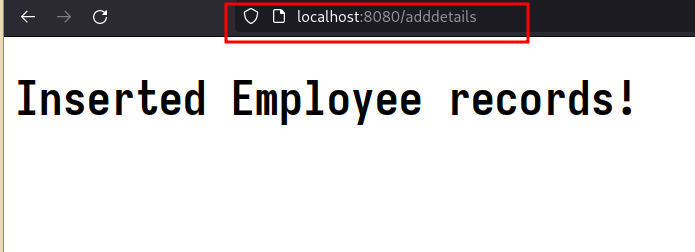
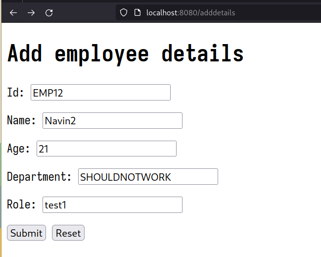

# MVC Patterns | OOAD LAB-9
## Details : 
- Name : P K Navin Shrinivas 
- SRN  : PES2UG20CS237 
- Section : D
## Lab content : 
- File structure : 
Used [this](https://start.spring.io/#!type=maven-project&groupId=com.example&artifactId=handling-form-submission&name=handling-form-submission&description=Demo%20project%20for%20Spring%20Boot&packageName=com.example.handling-form-submission&dependencies=web,thymeleaf) spring starter to create this project. This gives us a structure like so : 
![[Pasted image 20230407111634.png]]
> Note : The `html` files were later added by me as per requriments
- Code [Controller and Model]: 
```java
package com.example.handlingformsubmission;

import java.util.HashMap;

import org.springframework.boot.SpringApplication;
import org.springframework.boot.autoconfigure.SpringBootApplication;
import org.springframework.stereotype.Controller;
import org.springframework.ui.Model;
import org.springframework.web.bind.annotation.GetMapping;
import org.springframework.web.bind.annotation.ModelAttribute;
import org.springframework.web.bind.annotation.PostMapping;
import org.springframework.web.bind.annotation.RequestParam;

class Employee {
   private String ID;
   private String name;
   private String age;
   private String Department;
   private String role;

   Employee(){}

   Employee(String ID, String name, String age, String department, String role) {
      this.ID = ID;
      this.name = name;
      this.age = age;
      this.Department = department;
      this.role = role;
   }

   public String getID() {
      return ID;
   }

   public void setID(String iD) {
      ID = iD;
   }

   public String getName() {
      return name;
   }

   public void setName(String name) {
      this.name = name;
   }

   public String getAge() {
      return age;
   }

   public void setAge(String age) {
      this.age = age;
   }

   public String getDepartment() {
      return Department;
   }

   public void setDepartment(String department) {
      Department = department;
   }

   public String getRole() {
      return role;
   }

   public void setRole(String role) {
      this.role = role;
   }
}

class EmployeeDataModel {
   private static HashMap<String, Employee> m;
   static {
      m = new HashMap<String, Employee>();
   }

   public static void addEmployee(String ID, String name, String age, String department, String role) {
      Employee e = new Employee(ID, name, age, department, role);
      m.put(ID, e);
   }

   public static Employee getEmployee(String ID) {
      Employee e = m.get(ID);
      return e;
   }
}

@Controller
class EmployeeController {
   @GetMapping("/getdetails")
   public String displayDetails(@RequestParam("ID") String ID, Model model) {
      Employee e = EmployeeDataModel.getEmployee(ID);
      if (e == null) {
         return "invalid";
      }
      model.addAttribute("e", e);
      return "display";
   }

   @GetMapping("/adddetails")
   public String adddetailsForm(Model model) {
      model.addAttribute("employee",new Employee()); 
      return "adddetails";
   }

   @PostMapping("/adddetails")
   public String adddetailsSubmit(@ModelAttribute Employee e, Model model) {
      model.addAttribute("adddetails", e);
      if(EmployeeDataModel.getEmployee(e.getID())!=null){
         return "fail";
      }
      if (e.getID() == "" || e.getName() == "" || e.getAge() == "" || e.getDepartment() == "" || e.getRole() == ""){
         return "missing";
      }
      EmployeeDataModel.addEmployee(e.getID(), e.getName(), e.getAge(), e.getDepartment(), e.getRole());
      return "result";
   }
}

@SpringBootApplication
public class HandlingFormSubmissionApplication {

   public static void main(String[] args) {
      SpringApplication.run(HandlingFormSubmissionApplication.class, args);
   }

}
```
- As we can see in the above code and FS structure screenshot, I have 6 view. The code for 6 views : 
**adddata.html : **
```html
<!DOCTYPE HTML>
<html xmlns:th="https://www.thymeleaf.org">

<head>
   <title>Getting Started: Handling Form Submission</title>
   <meta http-equiv="Content-Type" content="text/html; charset=UTF-8" />
</head>

<body>
   <h1>Add employee details</h1>
   <form action="#" th:action="@{/adddetails}" th:object="${employee}" method="post">
      <p>Id: <input type="text" th:field="*{ID}" /></p>
      <p>Name: <input type="text" th:field="*{name}" /></p>
      <p>Age: <input type="text" th:field="*{age}" /></p>
      <p>Department: <input type="text" th:field="*{department}" /></p>
      <p>Role: <input type="text" th:field="*{role}" /></p>
      <p><input type="submit" value="Submit" /> <input type="reset" value="Reset" /></p>
   </form>
</body>

</html>
```

**display.html : **
```html
<!DOCTYPE HTML>
<html xmlns:th="https://www.thymeleaf.org">

<head>
   <title>Displaying Employee details!</title>
   <meta http-equiv="Content-Type" content="text/html; charset=UTF-8" />
</head>

<body>
   <h1>Employee Record Result :</h1>
   <p th:text="'ID: ' + ${e.ID}" />
   <p th:text="'Name: ' + ${e.name}" />
   <p th:text="'Age: ' + ${e.age}" />
   <p th:text="'Department: ' + ${e.department}" />
   <p th:text="'Role: ' + ${e.role}" />
</body>
</html>
```

**fail.html : **
```html
<!DOCTYPE HTML>
<html xmlns:th="https://www.thymeleaf.org">

<head>
   <title>Getting Started: Handling Form Submission</title>
   <meta http-equiv="Content-Type" content="text/html; charset=UTF-8" />
</head>

<body>
   <h1>Failed to insert Employee records :(, possibly cus of repeating ID.</h1>
</body>
</html>
```

**invalid.html : **
```html
<!DOCTYPE HTML>
<html xmlns:th="https://www.thymeleaf.org">

<head>
   <title>Displaying Employee details!</title>
   <meta http-equiv="Content-Type" content="text/html; charset=UTF-8" />
</head>

<body>
   <h1>Result</h1>
   <p> Invalid Employee ID, no employee with that ID found! </p>
</body>
</html>
```

**missing.html : **
```html
<!DOCTYPE HTML>
<html xmlns:th="https://www.thymeleaf.org">

<head>
   <title>Getting Started: Handling Form Submission</title>
   <meta http-equiv="Content-Type" content="text/html; charset=UTF-8" />
</head>

<body>
   <h1>Missing fields, please provide all fileds!</h1>
</body>

</html>
```

**result.html : **
```html
<!DOCTYPE HTML>
<html xmlns:th="https://www.thymeleaf.org">

<head>
   <title>Getting Started: Handling Form Submission</title>
   <meta http-equiv="Content-Type" content="text/html; charset=UTF-8" />
</head>

<body>
   <h1>Inserted Employee records!</h1>
</body>

</html>
```
- Screenshot : 






## MVC Pattern
### About MVC pattern
- MVC is an architechtural pattern, a pattern that seperated application interface and application logic.
- It does so my have 3 componenets to the program, the `model`, `view` and `controller`.
- It does something like so : 
![[Pasted image 20230407093815.png]]
- But in the above executed program, the interface is the STDOUT and STDOUT.
### Advantages of MVC : 
- Helps greately withh `scalability`.
- Helps with coding in a multi developer environment. 
- Greately increases reusability of the code!
- MVC being a widely used pattern, implementing such a pattens makes it easier for new programmers to maintain and develop on top of existing code.
### Feature of Spring MVC : 
- Allows to plugins to make view creation very easy, as in the above example, we are using something called `thymeleaf`. That finds the object strcutre and maps form fields almost with no additional work!
- The way the framwork usage is designed, you can keep the object in context the same but altering the views, this leads to very powerfull usage of the library.
### Problem statement : 
- To record and display Employee records.
### Code : 
> Pasted in above sections
### Running applications :
![[Pasted image 20230407112021.png]]
### UI Screenshots : 
> Provided in above sections
### Screenshot of database 
- In the above code, I'm using an in memory `HashMap` as the database.